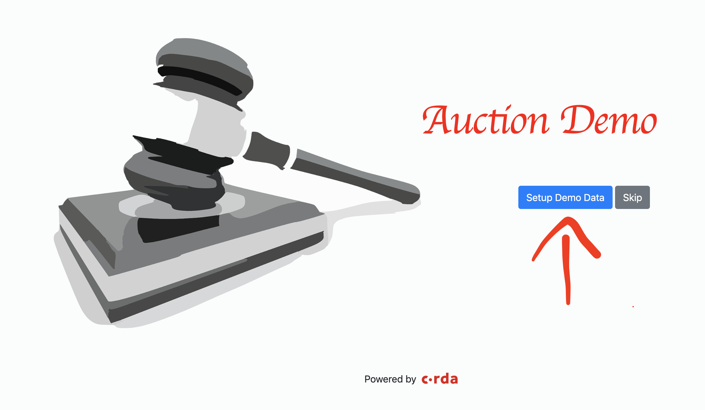
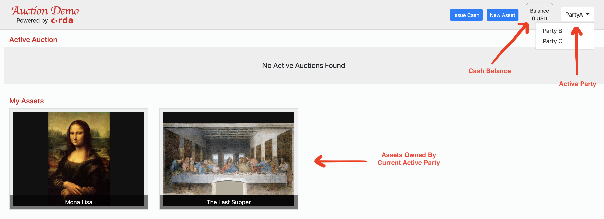
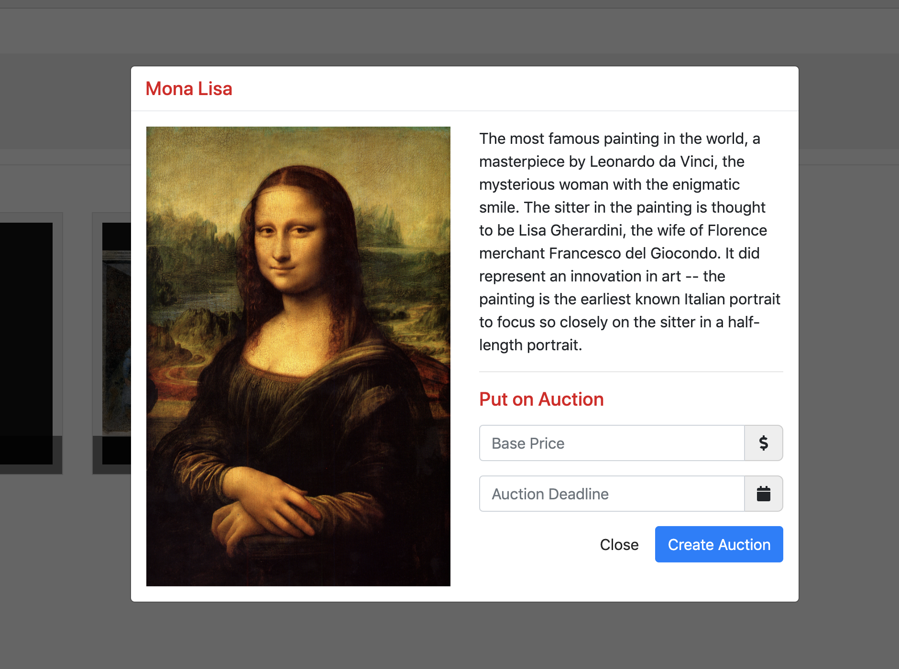
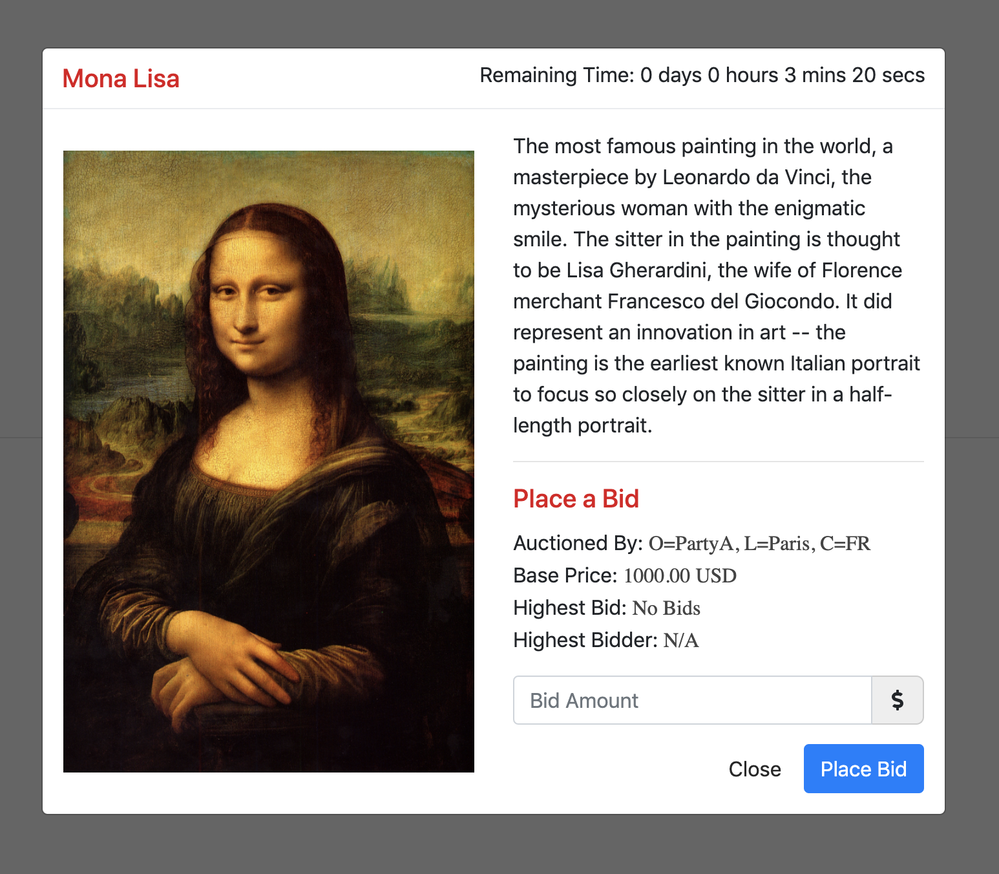
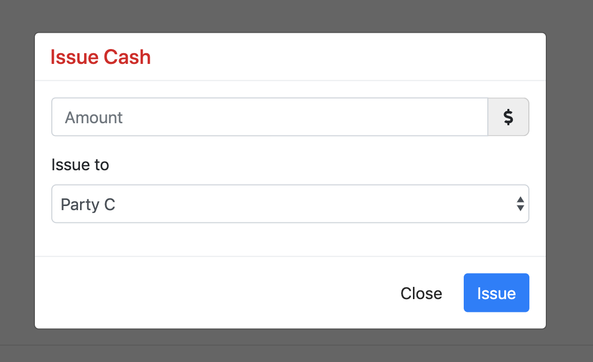
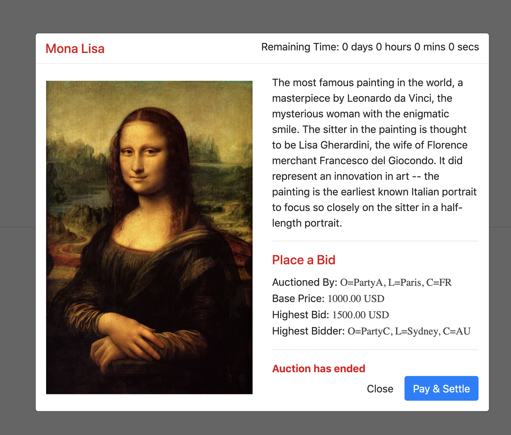

# Auction CorDapp

This CorDapp serves as a demo of building an auction application on Corda. It leverages
different features of Corda like `SchedulableState`, `StatePointer` and `OwnableState`. It also demonstrate 
how to perform a DvP (Delivery vs Payment) transaction on Corda.

It has a full-functional client included and an angular UI to interact with the nodes.

## CorDapp Components

### States
- `Asset`: It is an `OwnableState` that represents an asset that could be put on auction. The owner
of the asset should be able to put this asset on an auction.
- `AuctionState`: It represents the auction. It is designed as a `SchedulableState`, such that auction
could be scheduled to be made inactive, once the auction deadline is reached.

### Contracts:
- `AssetContract`: It is used to govern the evolution of the asset. In this case mostly change of 
ownership. Left black for simplicity. Has two commands, `CreateAsset` and `TransferAsset`.
- `AuctionContract`: It governs the evolution of the auction. The has the following commands:
    - `CreateAuction`: Validation rules governing the creation of the auction. 
    - `Bid`: Validation rules governing the bidding process of the auction.
    - `EndAuction`: Validation rules governing end of the auction i.e making the auction inactive
    once the auction bidding deadline has been reached.
    - `Settlement`: Validation rules for settlement of the auction i.e. transfer of asset to the 
    highest bidder and the highest bid amount transfer to the auctioneer.
    - `Exit`: Rules governing the exit (consumption/deletion) of the auction state.

### Flows:
- `CreateAssetFlow`: This flow is used create an asset.
- `CreateAuctionFlow`: This flow is used to create an auction. Once an asset has been created using
the`CreateAssetFlow`, this flow can be used to put the asset on auction. The `AuctionState` 
references to the `Asset` using a `StatePointer`. 
Refer here to learn more about StatePointer: 
https://medium.com/corda/linking-corda-states-using-statepointer-16e24e5e602
- `BidFlow`: It is used to place a bid on an auction. Bids can be placed only till a predetermined
deadline defined in the `AuctionState`. 
- `EndAuctionFlow`: This is a scheduled flow, which run automatically on auction deadline to mark 
the corresponding auction as inactive, so that it stop receiving bids.
- `AuctionSettlementFlow`: It is used to settle an auction once the bidding deadline has passed. It
internally triggers two flows:
    - `AuctionDvPFlow`: This flow takes care of the dvp operation for settlement of the auction. It
    transfers the asset on auction to the highest bidder and the highest bid amount is transferred to 
    the auctioneer. It happens as an atomic transaction.
    - `AuctionExitFlow`: Once the auction us settled, this flow is used to exit the auction state. This
    flow can also be triggered to  exit an auction which did not receive any bid till its deadline.

## Pre-requisites:
See https://docs.corda.net/getting-set-up.html.

## Running the nodes:
 
See https://docs.corda.net/tutorial-cordapp.html#running-the-example-cordapp.

## Running the client:

The client can be run by executing the below command from the project root:

`./gradlew runAuctionClient`

Please make sure that the nodes are already running before starting the client. 
The client can be accessed at http://localhost:8085/

## Usage

1. Click on the "Setup Demo Data" button to create somde demo data to play with or you
may use the skip button if you wish to setup the deata yourself.

2. The demo data setup would have created some assets from each of the parties. The assets
can be found under MyAssets Section. These assets could be put on auction. New assets can
be create using the create asset button.
The drop down at the top right corner can be used to toggle between parties.
The balance next to it indicates the current active parties cash balance. Cash can be 
issued using the Issue Cash Button.

3. Click on an asset to put it on auction. Input the `Base Price` and the `Auction Deadline`
and click in the Create Auction button to Create the Auction.

4. Once an auction is created it would be available in the `Active Auction` section. Its
now ready to accept bids. Switch to PartyB and place a bid, by clicking on the auction 
available in the `Active Auction` section.

5. Place one more bid by switching to PartyC.

6. What for the auction to end.

7. Once the auction is ended its ready to be settled. Settlement can be initiated by the 
highest bidder. Considering PartyC is the highest bidder, switch to PartyC.

8. Issue cash equivalent or greater than the highest bid amount for PartyC to pay for 
    the auction settlement.
 

9. Now click on the auction and initiate the settlement using the `Pay and Settle` Button. 
 

Notice the below things that would happed on auction settlement:

- Auctioned Assets ownership would be transferred to the highest bidder. The asset would 
now appear in the auction winners asset list (My Assets section).
- The auctioneers cash balance would be credited with amount equivalent to the highest bid.
- The highest bidders (PartyC in this case) cash balance would also be debited with amount 
equivalent to the highest bid. 
- The AuctionState would be consumed and the auction would no longer be visible.