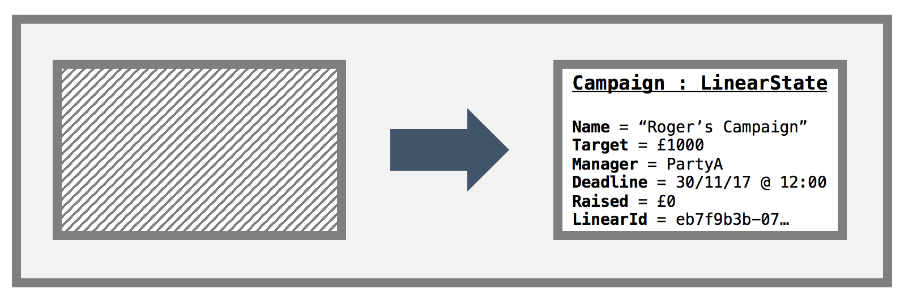
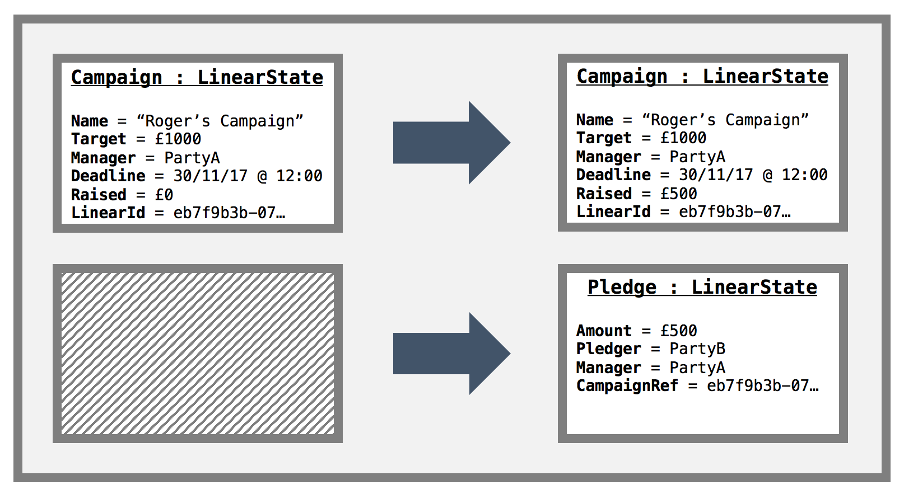
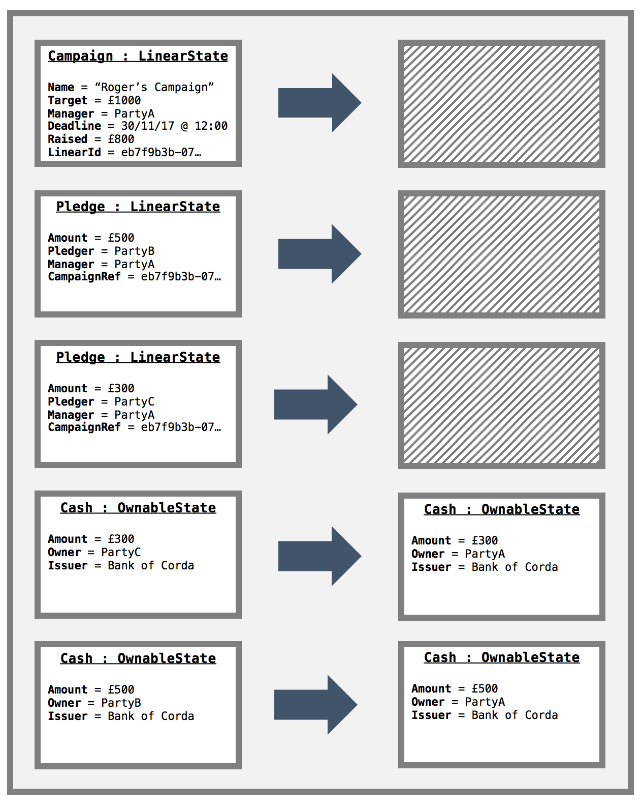
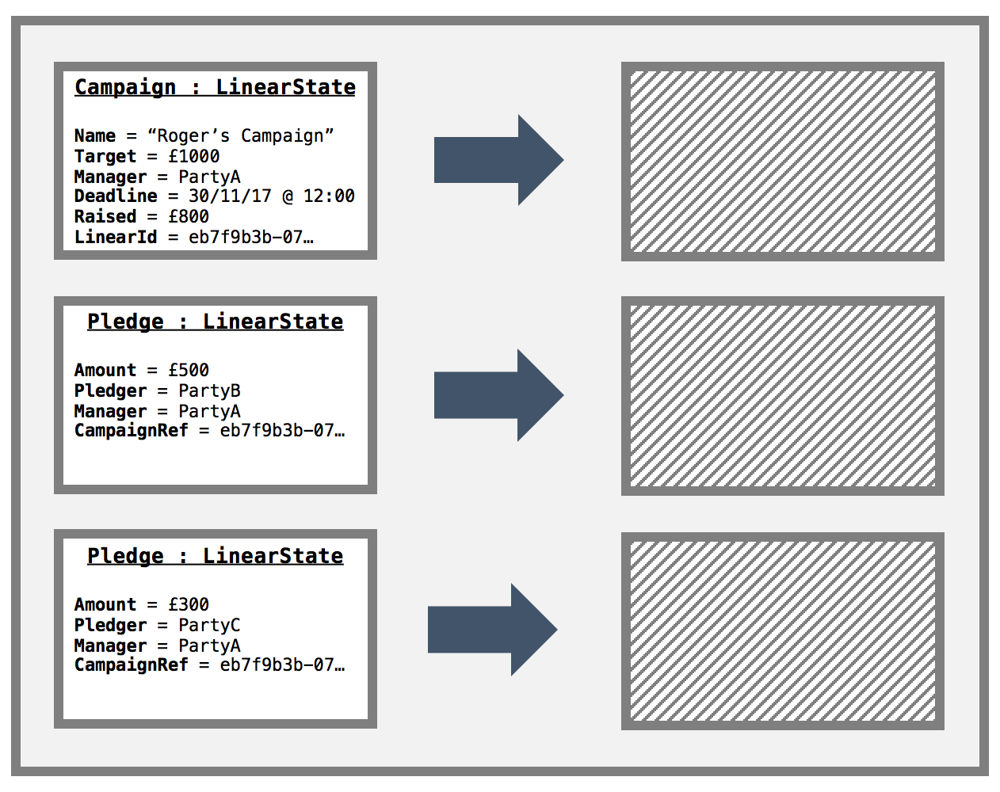

  

# Crowd Funding Demo (Observable States)

This is a small demo that aims to demonstrate the new observable states feature in Version 2 of Corda. As well as
observable states, it also uses the following features:

* Confidential identities
* Queryable states and custom vault queries
* Schedulable states

## TODO

1. Finish the contract and flow unit tests
2. Add a Spring Reactive web server
3. Finish the campaign contract code
4. Finish the README.md
6. Fill in the checkTransaction menthod of collect sigs flow
7. The manager should check that the cash transactions send the cash to him. For this to work, we need to use the same key for each cash state

## How it works

There are two types of parties:

* Campaign Managers
* Pledgers

As all nodes have the same CorDapp they all have the capability of setting up campaigns and pledging to other campaigns.

1. The demo begins with a node starting a new campaign. The node starting a new campaign becomes the manager for that
   campaign. The manager also needs to specify what the target amount to raise is, along with the campaign deadline and
   a name for the campaign. The manager is the only participant in the `Campaign` state, so it should *only* be stored 
   in the manager node's vault. However, as we use the observable states feature via the `BroadcastTransaction` and
   `RecordTransactionAsObserver` flows, all the other nodes on the network will store this campaign state in their
   vaults too. The create new campaign transaction looks like this:
   
   
   
2. To make a pledge to a campaign, a node user must know the `linearId` of the campaign they wish to pledge to. As all 
   the nodes on the network will receive new `Campaign` states, they can query their vault to enumerate all the 
   campaigns, then pick the one they wish to pledge to. Making a pledge requires a node user to specify the `linearId` 
   of the campaign they wish to pledge to as well as the amount they wish to pledge. The pledging node then constructs a 
   transaction that contains the new `Pledge` state as an output as well as the `Campaign` state to be updated. As such
   there is both a `Campaign` input and output. The transaction looks like this:
   
   
   
   The `CampaignContract` code ensures that `Campaign.raisedSoFar` property is updated in-line with the amount pledged. 
   Note in the above diagram, as this is the only pledge so far in this scenario, the `Campaign` output state reflects 
   the amount in the `Pledge` state.
   
   This as with the create campaign transaction covered above, this transaction is broadcast to all nodes on the 
   network. It is worth noting, that currently, one can only observe a *whole* transaction as opposed to parts of a 
   transaction. This is not necessarily an issue for privacy as the pledgers can create a confidential identity to use
   when pledging, such that it is only known by the pledger and the campaign manager. The main complication with only
   being able to store full transactions manifests itself when querying the vault - all the pledges that you have been
   broadcast, can be returned 
   
3. The `Campaign` is actually a `SchedulableState`. When we create a new campaign, we are required to enter a deadline 
   to which the campaign will run until. Once the deadline is reached, a flow is run to determine whether the campaign
   was a success or failure.
   
   **Success:** The campaign ends successfully if the target amount is reached. In this case, an atomic transaction is 
   produced to exit the `Campaign` state and all the `Pledge` states from the ledger as well as transfer the required
   pledged amounts in cash from the pledgers to the campaign manger.
   
   
   
   **Failure:** The campaign ends in failure if the target is not reached. In this case, an atomic transaction is 
   produced to exit the `Campaign` state and all the `Pledge` states from the ledger. The transaction looks like this:
   
   
   
   As with all the other transactions in this demo, these transactions will be broadcast to all other nodes on the 
   network.

## Assumptions

1. If a node makes a pledge, they will have enough cash to fulfill the pledge when the campaign ends.
2. Confidential pledger identities are adequate from a privacy perspective. We don't mind that the cash and pledge 
   states are shared to all nodes on the business network. If this an issue then we need to facilitate observable
   states via the use of `FilteredTransaction`s.
3. Each pledger can only make one pledger per campaign. They may update their pledge if they wish, though.
4. The `Campaign` state only needs to be signed by the campaign manager.
5. The `Pledge` states are bilateral agreements and are signed by the pledger and the campaign manager.
6. The `Campaign` state is included in all create pledge transactions to make sure the amount raised is updated with the 
   correct amount pledged. As such, if two pledgers try to pledge at the same time, one pledge will end up being a 
   double spend. We assume this is OK. 
7. Any node can start a `Campaign`.
8. Nodes can pledge to multiple `Campaign`s.
9. After the campaign ends, it is OK to exit the `Campaign` state and all the `Pledge` states.
10. Only campaign managers can cancel pledges and a pledge cancellation must be accompanied with a campaign state and
    campaign End command.

## Pre-Requisites

You will need the following installed on your machine before you can start:

* [JDK 8](http://www.oracle.com/technetwork/java/javase/downloads/jdk8-downloads-2133151.html) 
  installed and available on your path (Minimum version: 1.8_131).
* [IntelliJ IDEA](https://www.jetbrains.com/idea/download/) (Minimum version 2017.1)
* git
* Optional: [h2 web console](http://www.h2database.com/html/download.html)
  (download the "platform-independent zip")

For more detailed information, see the
[getting set up](https://docs.corda.net/getting-set-up.html) page on the
Corda docsite.

## Running the unit tests 

Via gradle:

**Unix:** 

     ./gradlew clean test

**Windows:**

     gradlew.bat clean test
    
If you want to run the tests via IntelliJ then navigate to `cordapp/strc/test/kotlin/net.corda.demos.crowdFunding` in 
the project explorer to see the unit test files. To run a test click the Green arrow in the left handle margin of the 
editor.

# Running the CorDapp

## Clone the repo

To get started, clone this repository with:

     git clone https://github.com/roger3cev/observable-states.git

And change directories to the newly cloned repo:

     cd observable-states

## Building the CorDapp:

**Unix:** 

     ./gradlew deployNodes

**Windows:**

     gradlew.bat deployNodes

Note: You'll need to re-run this build step after making any changes to
the template for these to take effect on the node.

## Running the Nodes

Once the build finishes, change directories to the folder where the newly
built nodes are located:

     cd build/nodes

The Gradle build script will have created a folder for each node. You'll
see three folders, one for each node and a `runnodes` script. You can
run the nodes with:

**Unix:**

    ./runnodes --log-to-console --logging-level=INFO

**Windows:**

    runnodes.bat --log-to-console --logging-level=INFO

You should now have three Corda nodes running on your machine serving 
the template.

When the nodes have booted up, you should see a message like the following 
in the console: 

     Node started up and registered in 5.007 sec

## Interacting with the CorDapp via HTTP

To be added.

## Further reading

Tutorials and developer docs for CorDapps and Corda are
[here](https://docs.corda.net/).
