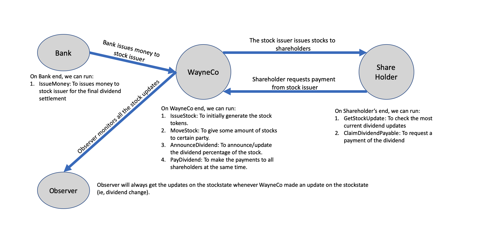

  

# TokenSDK Sample - Stock Pay Dividend CorDapp - Java
This CorDapp aims to demonstrate the usage of TokenSDK, especially the concept of EvolvableToken which represents stock.
You will find the StockState extends from EvolvableToken which allows the stock details(eg. announcing dividends) to be updated without affecting the parties who own the stock.

This Stock Exchange CorDapp includes:
* A bank issues some money for the final settlement of the dividends.
* A company/stock issuer(WayneCo) issues and moves stocks to shareholders
* The company announces dividends for shareholders to claim before execution day
* Shareholder retrieves the most updated stock information and then claims dividend
* The company distribute dividends to shareholders

### Running the nodes:
See https://docs.corda.net/tutorial-cordapp.html#running-the-example-cordapp.

## Sample Overview

### Keys to learn
* Basic usage of TokenSDK
* How the state of stock (ie. EvolvableToken) updates independently without stock holders involved 
* Use of `TokenSelection.generateMove()` and `MoveTokensUtilitiesKt.addMoveTokens()` to generate move of tokens
* Adding observers in token transactions with TokenSDK 

*Note that some date constraint(eg. payday) is being commented out to make sure the sample can be ran smoothly  

### States
* **[StockState](contracts/src/main/java/net/corda/examples/stockpaydividend/states/StockState.java)** -
which holds the underlying information of a stock like stock name, symbol, dividend, etc.  
* **[DividendState](contracts/src/main/java/net/corda/examples/stockpaydividend/states/DividendState.java)** -
represents the dividend to be paid off by the company to the shareholder. 

### Roles
This CordApp assumes there are 4 parties
* **WayneCo** - who creates and maintains the stock state and pay dividends to shareholders after time.
* **Shareholder** - who receives dividends base on the owning stock.
* **Bank** - who issues fiat tokens.
* **Observer** - who monitors all the stocks by keeping a copy of of transactions whenever a stock is created or updated. 
 In real life, it should be the financial regulatory authorities like SEC  

### Running the sample
To go through the sample flow, execute the commands on the corresponding node  

##### Pre-requisite. IssueMoney - Bank
In order to pay off dividends from the company later, the bank issues some fiat tokens to the WayneCo.
This can be executed anytime before step 6. 
>On bank node, execute  `start IssueMoney currency: USD, amount: 500000, recipient: WayneCo`

##### 1. IssueStock - Stock Issuer
WayneCo creates a StockState and issues some stock tokens associated to the created StockState.
>On company WayneCo's node, execute  `start IssueStock symbol: TEST, name: "Stock, SP500", currency: USD, price: 7.4, issueVol: 500, notary: Notary`

##### 2. MoveStock - Stock Issuer
WayneCo transfers some stock tokens to the Shareholder.
>On company WayneCo's node, execute  `start MoveStock symbol: TEST, quantity: 100, recipient: Shareholder`

Now at the Shareholder's terminal, we can see that it received 100 stock tokens:
>On shareholder node, execute  `start GetStockBalance symbol: TEST`

##### 3. AnnounceDividend - Stock Issuer
WayneCo announces the dividends that will be paid on the payday.
>On WayneCo's node, execute  `start AnnounceDividend symbol: TEST, dividendPercentage: 0.05, executionDate: "2019-11-22T00:00:00Z", payDate: "2019-11-23T00:00:00Z"`

##### 4. GetStockUpdate - Shareholder
Shareholders retrieves the newest stock state from the company. 
>On shareholder node, execute  `start GetStockUpdate symbol: TEST`

##### 5. ClaimDividendReceivable - Shareholder
Shareholders finds the dividend is announced and claims the dividends base on the owning stock. 
>On shareholder node, execute  `start ClaimDividendReceivable symbol: TEST`

##### 6. PayDividend - Company
On the payday, the company pay off the stock with fiat currencies.
>On WayneCo node, execute  `start PayDividend`

##### 7. Get token balances - Any node
Query the balances of different nodes. This can be executed at anytime.
> Get stock token balances 
 `start GetStockBalance symbol: TEST`

>Get fiat token balances
 `start GetFiatBalance currencyCode: USD`

#### Test case
You can also find the flow and example data from the test class [FlowTests.java](workflows/src/test/java/net/corda/examples/stockpaydividend/FlowTests.java).
 
### Useful links
##### Documentations
[Token-SDK tutorial](https://github.com/corda/token-sdk/blob/master/docs/DvPTutorial.md)
 
[Token-SDK design document](https://github.com/corda/token-sdk/blob/95b7bac668c68f3108bca2c50f4f926d147ee763/design/design.md#evolvabletokentype)

##### Other materials
[Blog - House trading sample](https://medium.com/corda/lets-create-some-tokens-5e7f94c39d13) - 
A less complicated sample of TokenSDK about trading house.
 
[Blog - Introduction to Token SDK in Corda](https://medium.com/corda/introduction-to-token-sdk-in-corda-9b4dbcf71025) -
Provides basic understanding from the ground up.
 
[Sample - TokenSDK with Account](https://github.com/corda/accounts/tree/master/examples/tokens-integration-test)
An basic sample of how account feature can be integrated with TokenSDK

